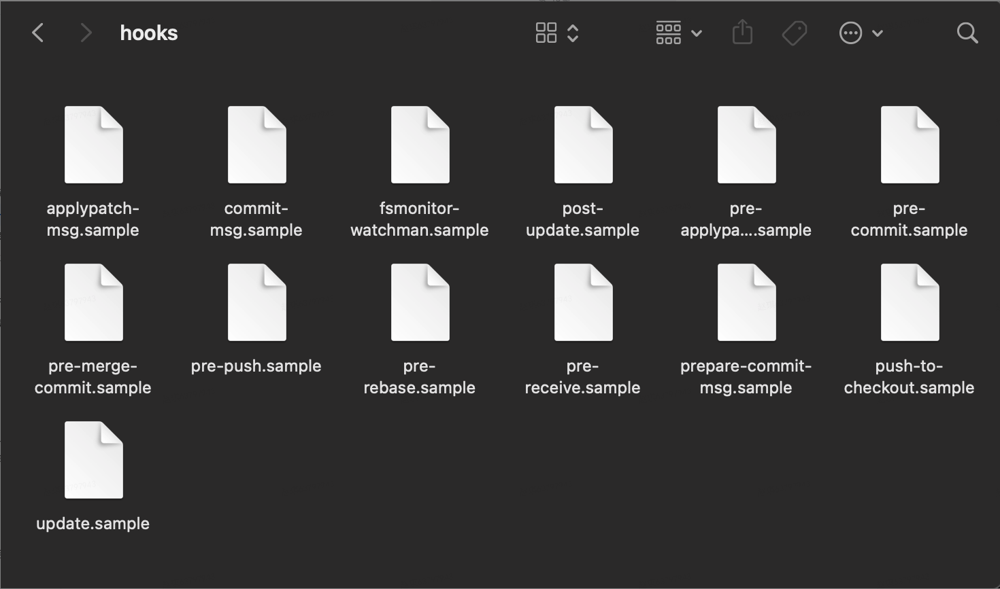

# Git Hooks

## Git Hooks 是什么

Git 官方文档中是这样定义 Git Hooks 的：

> 和其他版本控制系统一样，Git 能在特定的重要动作发生时触发自定义脚本。有两组这样的钩子：客户端的和服务器端的。客户端钩子由注入提交和合并这样的操作所调用，而服务器端钩子作用于诸如接收被推送的提交这样的联网操作。你可以随心所欲的运用这些钩子。

简而言之：Git Hooks 就是类似于 Vue 的生命周期钩子一样，在 Git 运行周期里面的某些时间点，可以让用户添加和执行自定义的脚本。

## Git Hooks 是如何工作的

Git Hooks 都被存储在 Git 目录下的 hooks 子目录中，也即 git repo 项目中的 .git/hooks。你可以在这个目录下自由定制 Hooks 的功能， 当触发一些 Git 行为时，相应地 Hooks 将被执行。

下图为用 git init 初始化一个新版本库后，Git 在 hooks 目录中放置的一些示例脚本。这些示例脚本的名字都是以 .simple 结尾的，移除掉这些文件的名称后缀，或者直接以下图中的名字直接命名，就会把该脚本绑定到特定的 Git 行为上。

## Git Hooks 分类

按照 Git Hooks 脚本所在位置可以分为两大类：

- 客户端钩子（本地 Hooks），触发事件如 commit、merge 等
  - 提交工作流钩子
  - 电子邮件工作流钩子
  - 其他钩子
- 服务器端钩子，触发事件如 receive 等

这里仅学习提交工作流钩子

### 提交工作流钩子 Commit Hooks

与 git commit 相关的 hooks 一共有四个，均有 git commit 命令触发调用，按照一次发生的顺序分别是：

#### pre-commit

钩子在键入提交信息前运行。它用于检查即将提交的快照，例如，检查是否有所遗漏，确保测试运行，以及核查代码。一般会利用该钩子来检查代码风格是否一致。如果该钩子以非零值退出，Git 将放弃此次提交，不过可以用 git commit --no-verify 来绕过这个环节。

#### prepare-commit-msg

钩子在启动提交信息编辑器之前，默认信息被创建之后运行。这个钩子的作用是用来编辑 commit 的默认提交说明。该脚本有 1~3 个参数：存有当前提交信息的文件路径、提交类型和修补提交的 SHA-1 校验。这个脚本用的机会不是太多，主要是用于能自动生成 commit message 的情况。 不会因为 --no-verify 参数而禁用，如果脚本运行失败（返回非零值），Git 提交就会被终止。

#### commit-msg

钩子接受一个参数：存有当前提交信息的临时文件路径。该钩子可以用来验证提交说明的规范性，如果修改者的提交说明不符合指定路径文件中的规范，提交就会被终止。该脚本可以通过传递--no-verify参数而禁用，如果脚本运行失败（返回非零值），Git 提交就会被终止。

#### post-commit

钩子发生在整个提交过程完成之后。这个脚本不包含人和参数，也不会影响 commit 的运行结果，可以用于通知之类的事情。

## 参考资料

- [Git Hooks](https://git-scm.com/book/zh/v2/%E8%87%AA%E5%AE%9A%E4%B9%89-Git-Git-%E9%92%A9%E5%AD%90)
