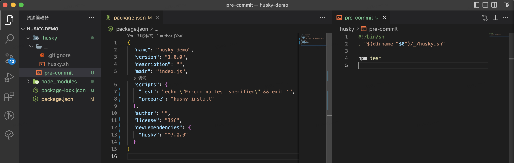
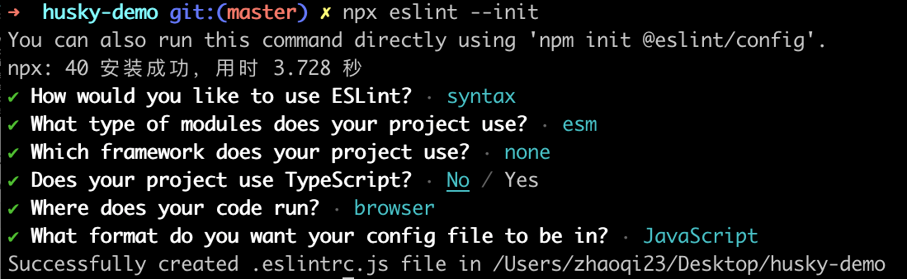
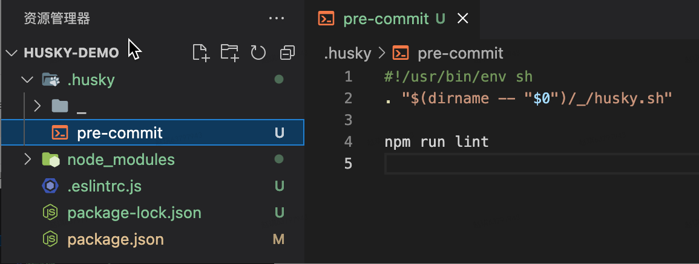
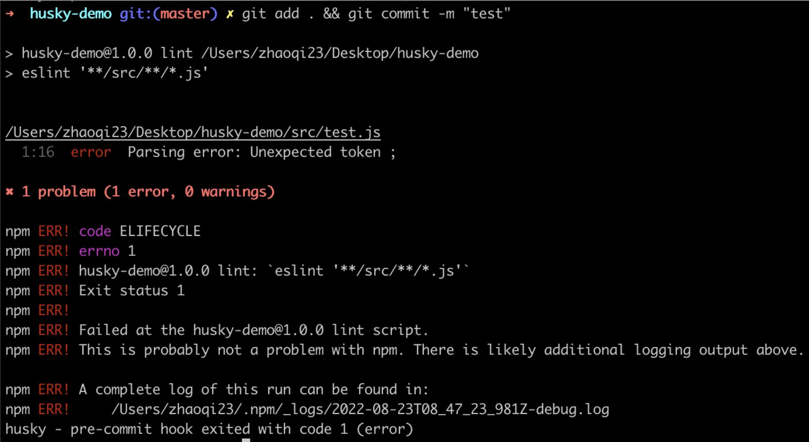

# Husky

## Husky 是什么

官方文档定义：

> Modern native git hooks made easy
Husky improves your commits and more 🐶 woof!
You can use it to lint your commit messages, run tests, lint code, etc... when you commit or push. Husky supports all Git hooks.

用一句话概括，那就是它能够简化上述创建或修改 Git Hooks 的操作。

## 如何使用 Husky

这里我们先创建一个 demo 项目，并完成 `git` 和 `npm` 初始化操作。借助这个 demo 项目学习 Husky 的使用方式。

### 安装

Husky 支持自动和手动安装两种方式：

#### 自动安装

执行 `npx husky-init && npm install` 指令

它将设置 husky，修改 package.json 并创建一个 pre-commit 您可以编辑的示例钩子。默认情况下，它将在你提交时运行 npm test 指令。



#### 手动安装

安装 `husky`，执行 `npm install husky --save-dev` 指令

启用 `Git Hooks`，执行 `npx husky install` 指令

如果要在 `npm install` 后自动启用 `Git Hooks`，需要手动编辑 `package.json` 文件，补充下面的内容：

```json
// package.json
{
  "script": {
    "prepare": "husky install"
  }
}
```

### 创建钩子

要将命令添加到钩子或者创建新命令，则可以使用 `husky add <file> [cmd]` 指令。

这里我们创建 `pre-commit` 钩子，模拟用户在 commit 时自动校验 JS 语法的场景：

#### 安装 eslint 并初始化

```shell
npm install eslint --save-dev

npx eslint --init
```

这里仅做演示使用，eslint 都只选择最简单的配置



#### 添加 scripts 配置

在 `packag.json` 中添加如下配置：

```json
// package.json
{
  "script": {
    "lint": "eslint '**/src/**/*.js'"
  }
}
```

#### 创建 pre-commit 钩子

```shell
npx husky add .husky/pre-commit "npm run lint"
```

此时 .husky 目录下将自动创建 `pre-commit` 文件，并在用户执行 `git commit` 时会自动校验项目 src 目录下的 js 文件。



#### 新增JS文件并执行 git commit 命令

创建 src 目录，并在该目录下新增一个存在语法错误的 JS 文件

```js
// src/test.js
const testA = {;
console.log(testA);
```

此时执行 `git add . && git commit -m "test"` 指令，可以看到在 commit 之前会进行检测，检测到错误的时候会返回错误提示，并且阻止 commit 行为



### 卸载

执行该指令将成功卸载 `husky`

```shell
npm uninstall husky && git config --unset core.hooksPath
```

## 参考资料

- [Husky](https://typicode.github.io/husky/#/)
- [Why husky has dropped conventional JS config](https://blog.typicode.com/husky-git-hooks-javascript-config/)
- [Husky，这只哈士奇是什么？](https://juejin.cn/post/6978462327796400136#heading-4)
