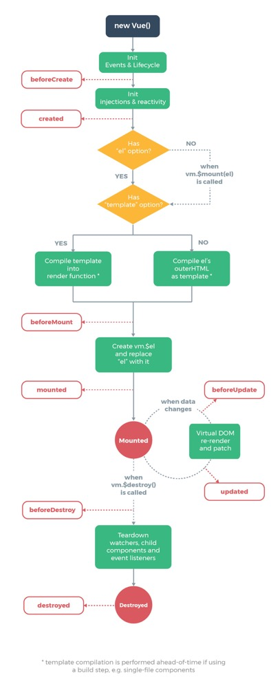

# 生命周期

每个 Vue 实例在被创建时都要经过一系列的初始化过程——例如，需要设置数据监听、编译模板、将实例挂载到 DOM 并在数据变化时更新 DOM 等。同时在这个过程中也会运行一些叫做**生命周期钩子**的函数，这给了用户在不同阶段添加自己的代码的机会。

## beforeCreate( 创建前 )

实例初始化之后，数据观测和事件配置之前被调用。此时组件的选项对象还未创建，`el` 和 `data` 并未初始化，因此无法访问 `methods`， `data`， `computed` 等上的方法和数据。

## created ( 创建后 ）

实例已经创建完成之后被调用。在该阶段，实例已完成以下配置：数据观测、属性和方法的运算，`watch/event` 事件回调，完成了 `data` 数据的初始化，`el` 没有。 然而，挂载阶段还没有开始, `$el` 属性目前不可见。在这个阶段，你可以调用 `methods` 中的方法、改变 `data` 中的数据（并且修改可以通过 vue 的响应式机制体现在页面上）、获取 `computed` 中的计算属性等，通常我们可以在这里对实例进行预处理。

## beforeMount

挂载开始之前被调用。相关的 `render` 函数首次被调用（虚拟 DOM），实例已完成以下的配置： 编译模板，把 `data` 里面的数据和模板生成 HTML，完成了 `el` 和 `data` 初始化，注意此时还没有挂载 HTML 到页面上。

## mounted

挂载完成，也就是将模版渲染到 HTML 页面中，此时可以做一些请求操作， `mounted` 只会执行一次。

## beforeUpdate

数据更新之前被调用，发生在虚拟 DOM 重新渲染之前。可以在该阶段进一步地更改状态，不会触发附加地重渲染过程

## updated（更新后）

数据更改导致虚拟 DOM 重新渲染时会调用该钩子函数。调用时组件 DOM 已经更新，因此可以执行依赖于 DOM 的操作。在大多是情况下，应该避免在此期间更改状态，因为这可能会导致更新操作无限循环。

## beforeDestroy（销毁前）

实例销毁之前调用。实例仍然完全可用，这一步还可以用 `this` 来获取实例，一般在这一步做一些重置的操作，比如清除掉组件中的定时器和监听的 DOM 事件。

## destroyed（销毁后）

实例销毁之后调用。调用后，所有的事件监听器会被移出，所有的子实例也会被销毁。
